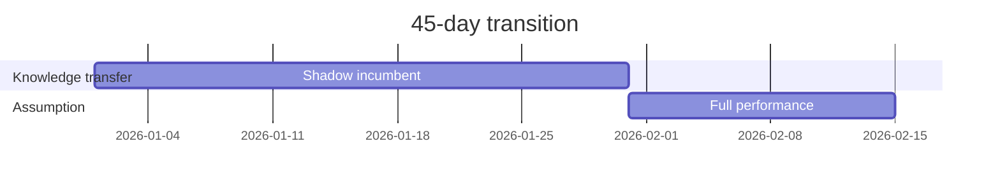
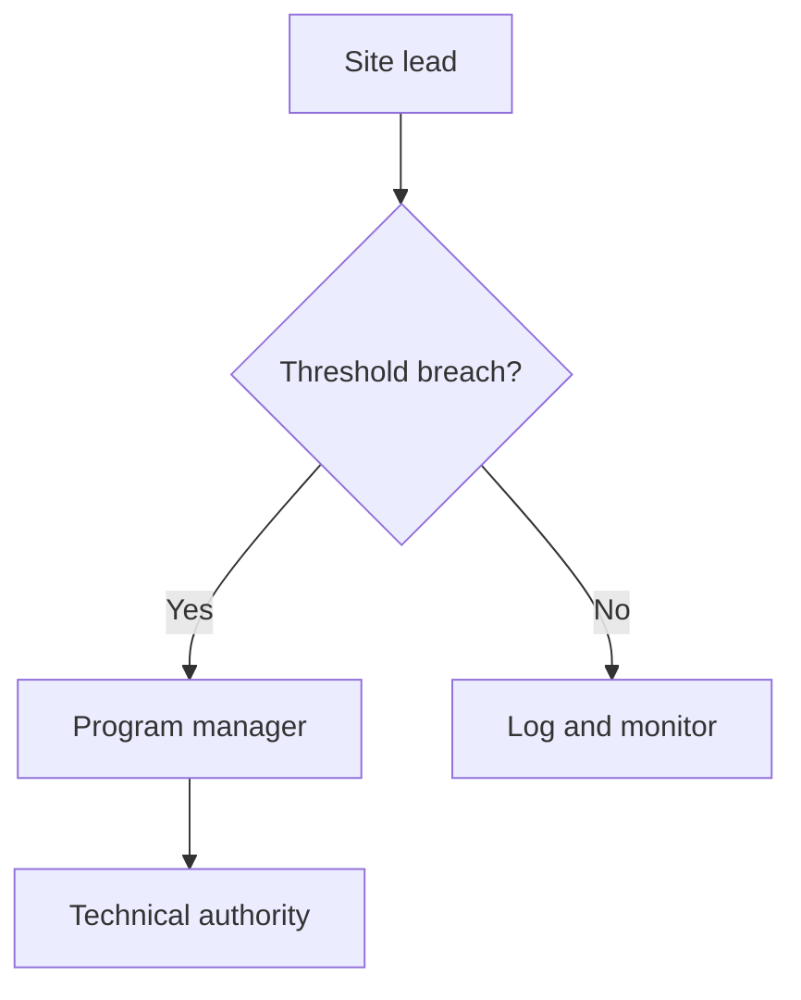

## 2.4 Transition Plan

Our transition team assumes performance within 45 calendar days of award.

### Figure 2-4 — Transition schedule

**Action caption:** Overlapping knowledge transfer during the incumbent's final
30 days removes the service gap the Government experienced at the last transition.

### Figure 2-5 — Escalation path

**Action caption:** Escalation

